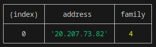
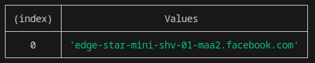
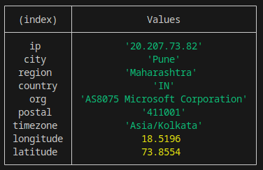

# domainprobe-cli
The Domainprobe CLI provides a command-line interface for the Domain Info Extractor package, allowing users to perform operations related to IP addresses, hostnames, and domain information.

## Installation:
- `npm install domainprobe-cli` or `npm install -g domainprobe-cli`

## Usage:
- **Command syntax**
- `domainprobe <operation> <input>`

## Available Operations:

**ip:** Retrieve the IP address of a domain.
**hostname:** Retrieve hostnames associated with an IP address.
**domain-info:** Retrieve detailed information about a domain.
**ip-info:** Retrieve detailed information about an IP address.

## Example 1:
- ***command***-
```bash
    domainprobe ip https://github.com/
```

- ***output***-



## Example 2:
- ***command***-
```bash
    domainprobe hostname 157.240.23.35

```

- ***output***-



## Example 3:
- ***command***-
```bash
    domainprobe domain-info https://github.com/


```
- ***Output***-


## Example 4:
- ***command***-
```bash
    domainprobe ip-info 20.207.73.82

```
- ***output***-

